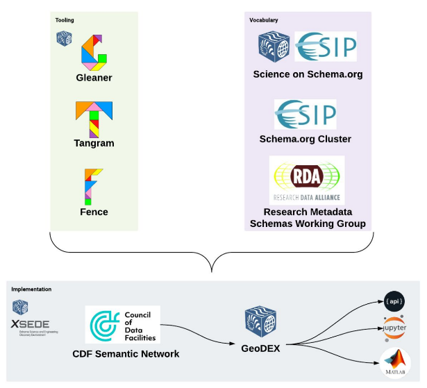

# Gleaner (https://gleaner.io)

Extracts JSON-LD from web pages exposed in a domains sitemap file.  
## About


 
 

A set of cloud based tools and functions can be found https://fence.gleaner.io/ These can be usd 
online via the browser or through command line calls.  
They are also available for use in Jupyter notebooks do develop out workflows with.

## More 

*The Summoner*, which uses site map files to access and parse facility 
resources pages.  Summoner places the results of these calls into a S3 API 
compliant storage. 

*The Miller*, which takes the JSON-LD documents pulled and stored by 
summoner and runs them through various millers.  These millers can do 
various things. 


 The current millers are:

* text:  build a text index in raw bleve
* spatial: parse and build a spatial index using a geohash server
* graph: convert the JSON-LD to RDF for SPARQL queries

A set of other millers exist that are more experimental

* tika: access the actual data files referneced by the JSON-LD and process
    through Apache Tika.  The extracted text is then indexed in text system allowing 
    full text search on the document contents.
* blast: like text, but using the blast package built on bleve
* fdptika: like tika, but using Frictionless Data Packages
* ftpgraph: like graph, but pulling JSON-LD files from Frictionless Data Packages
* prov: build a basic prov graph from the overall gleaner process
* shacl: validate the facility resoruces against defined SHACL shape graphs 


## Building

Gleaner is built in 100% Go which can be found and installed from [htttps://golang.org](https://golang.org).
Gleaner uses [Go Modules](https://blog.golang.org/using-go-modules) so all dependencies will be downloaded 
at compile time.  So a simple;

```bash
GOOS=linux GOARCH=amd64 CGO_ENABLED=0 env go build -o gleanerio
```

in root there will be enough to resolve dependencies and build the binary.  
There is also a Makefile with basic commands if you have and use Make.  Note
the docker push will need to be edited to support your setup.

There is a docker build file as well in the deployments directory if you wish to use the tool that way.  
However, there are some issues with using Gleaner in Docker/

## How to run (or at least try..., this is still a work in progress)

A key focus of current develoipment is to make it easy for groups to
run Gleaner locally as a means to test and validate their structured
data publishing workflow.  

### Running

Some early documentation on running gleaner can be found at:
[Running Gleaner](./docs/runningGleaner.md).

### Validation (SHACL Shapes)

Work on the validation of data graphs using W3C SHACL shape graphs is 
taing place in the [GeoShapes repository](https://github.com/geoschemas-org/geoshapes).  Gleaner leverages the pySHACL
Python package to perform the actual validation.  

### Profiling  (for dev work)

You can profile runs with 

```bash
go tool pprof --pdf gleaner /tmp/profile317320184/cpu.pprof  > profileRun1.pdf
```

Example CPU and Memory profile of a recent release.  

