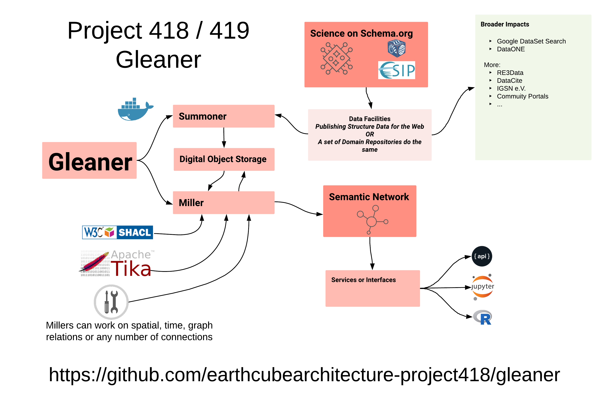

# Gleaner

## Visit https://gleaner.io

## About

Many facilities are working to align with FAIR data principles. The
publishing of both human and machine readable metadata in a common manner and
leveraging open and standards based protocols are supporting activities.
Better alignment with FAIR principles is also a component in many facility
certification efforts while commercially backed tools like Google DataSet Search
leverage this work to provide expansive and easy searching of data resources.
Within the geoscience community, the work at Science on Schema is a key
community partner to help providers with this publishing work.  Gleaner also
leverages this work.

Gleaner is an open source tool, written in Go, that compiles to a simple single
static binary across most platforms.   It is designed to leverage sitemaps to
access resources and extract JSON-LD encoded structured data.   It can perform
various actions on these collected resources then.   Validation through calling
SHACL services like Tangram, form checking (making sure the basic structure is
proper) and generating indexes.    The basic index generated is a graph, formed
from the various individual data graphs for each resource.   This can then be
fed into a graph database and used for searching, analysis or exposed through
Web APIs or other approaches like GraphQL.   Results of Gleaner could also be
used to feed Elasticsearch or other data systems though spatial or even temporal
indexes could be formed from the exposed data. 

Gleaner can also be used as a tool to quickly test and evaluate facility or
community resources publishing patterns to ensure better alignment with
commercial or other indexing services.  As such, Gleaner is part of a "Data Ops"
approach to rapid and iterative data publishing.

Gleaner is simply an implementation of web architecture patterns and client code
focused on accessing and indexing these resources.

 
 

A set of cloud based tools and functions can be found https://fence.gleaner.io/ These can be usd 
online via the browser or through command line calls.  
They are also available for use in Jupyter notebooks do develop out workflows with.

## More 

*The Summoner*, which uses site map files to access and parse facility 
resources pages.  Summoner places the results of these calls into a S3 API 
compliant storage. 

*The Miller*, which takes the JSON-LD documents pulled and stored by 
summoner and runs them through various millers.  These millers can do 
various things. 



 The current millers are:

* text:  build a text index in raw bleve
* spatial: parse and build a spatial index using a geohash server
* graph: convert the JSON-LD to RDF for SPARQL queries

A set of other millers exist that are more experimental

* tika: access the actual data files referneced by the JSON-LD and process
    through Apache Tika.  The extracted text is then indexed in text system allowing 
    full text search on the document contents.
* blast: like text, but using the blast package built on bleve
* fdptika: like tika, but using Frictionless Data Packages
* ftpgraph: like graph, but pulling JSON-LD files from Frictionless Data Packages
* prov: build a basic prov graph from the overall gleaner process
* shacl: validate the facility resoruces against defined SHACL shape graphs 

## How to run (or at least try..., this is still a work in progress)

A key focus of current develoipment is to make it easy for groups to
run Gleaner locally as a means to test and validate their structured
data publishing workflow.  

### Running

Some early documentation on running gleaner can be found at:
[Running Gleaner](./docs/runningGleaner.md).

### Validation (SHACL Shapes)

Work on the validation of data graphs using W3C SHACL shape graphs is 
taing place in the [GeoShapes repository](https://github.com/geoschemas-org/geoshapes).  Gleaner leverages the pySHACL
Python package to perform the actual validation.  

### Profiling  (for dev work)

You can profile runs with 

```bash
go tool pprof --pdf gleaner /tmp/profile317320184/cpu.pprof  > profileRun1.pdf
```

Example CPU and Memory profile of a recent release.  

